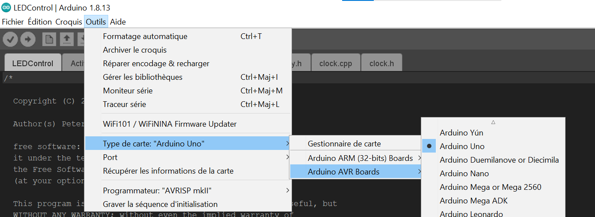
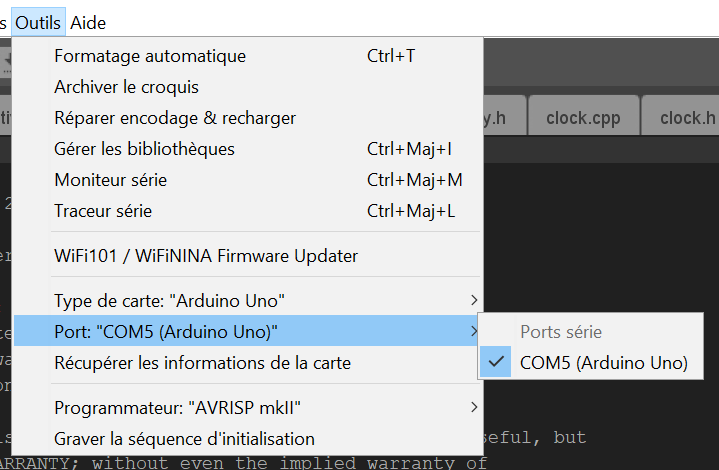
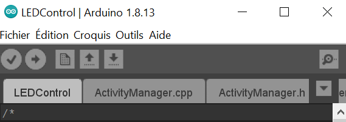
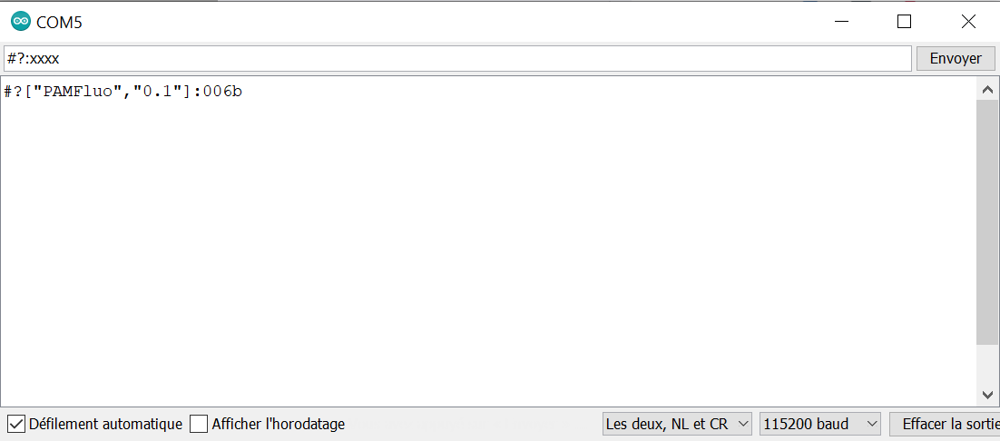
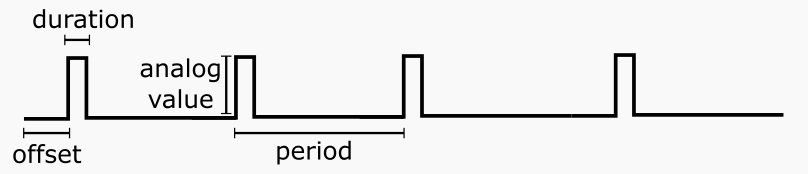
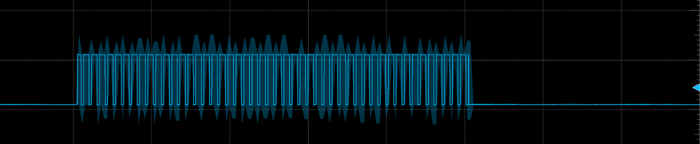
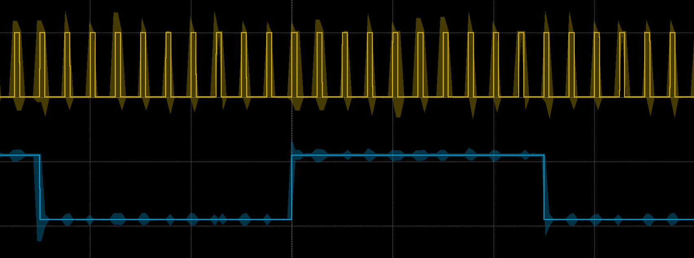
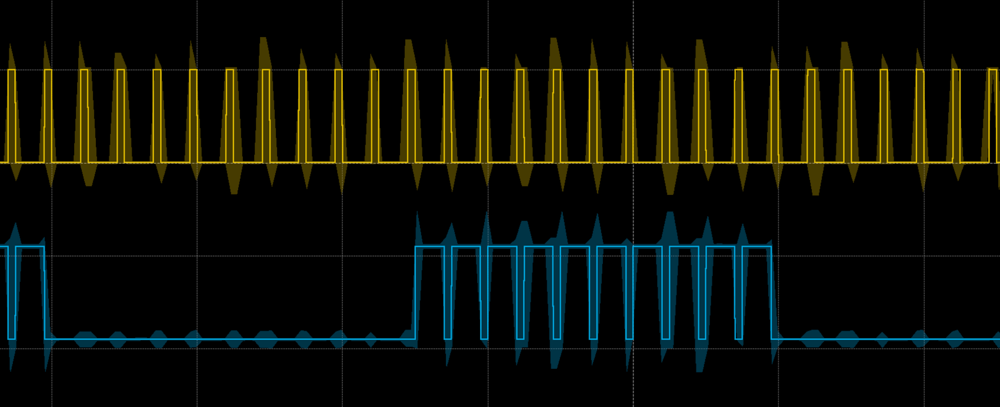

# CSL-light

This repository demonstrates how to control light sources with Arduino and Python, and output a trigger signal to synchronize a camera. 

The codes rely on [Arduino](https://www.arduino.cc/) and [pyserial](https://github.com/pyserial/pyserial).


## Pre-requisites
- Install RomiSerial and the Arduino software XXXX
- The light sources are already set-up. Refer to the example gallery for ideas. 
- The light sources can be controlled by a trigger, or pulse-width modulated signal (PWM) 
- The code was tested on Windows and Linux
  


## Hardware :gear:
Here are the different hardware equipment the 

| Component | Quantity | Price per unit | Example |
|----------|:-------------:|:-------------:|:-------------:|  
| Arduino Uno | 1| 24€ | [Robotshop](https://www.robotshop.com/eu/fr/microcontroleur-arduino-uno-r3-usb.html)
|  Light source controller | tested up to 5 | X| [Thorlabs](https://www.thorlabs.com/newgrouppage9.cfm?objectgroup_id=2616) 

## Software :desktop_computer:


| Software | Version we used | Download |
|----------|:-------------:|:-------------:|  
| Arduino | 1.8.13 | [download](https://www.arduino.cc/en/software)
| Python  | 3 |[install](https://github.com/Alienor134/Teaching/blob/master/Python/Installing_Anaconda_creating_environment.md)
| CSL-serial | 1.0 | [install](XXX)


## Codes and files provided :chart_with_upwards_trend:

[CSLlight](CSLlight/CSLlight.py) can be used the following way:


```python
from CSLlight import ControlLight

arduino_port = "COM5"
sec = 1000 #conversion ms to s
blue_param = {'pin': 11,
              'offset': 0.5*sec, #ms
              'period': 5*sec, #ms
              'duration': 2*sec, #ms
              'analog_value': 255
              }

arduino_light = ControlLight(arduino_port)
arduino_light.add_digital_pulse(blue_param)

arduino_light.start_measurement(300*sec)
arduino_light.wait()

```

The lights are controlled with periodic digital pulses. Each light has its own configuration, as in the `blue_param` variable in the example above. The following parameters are expected:

* `pin`: The Arduino pin to which the LED light is connected.
* `period`: The period of the output signal (an integer value in milliseconds).
* `duration`: The amount of time the signal is 'on' during a period. This is an integer in milliseconds and should be less than the period.
* `offset`: The number of milliseconds that the signal should be delayed (milliseconds). 
* `analog_value`: When the light is 'on', it is possible to generate a PWM signal. The underlying implementation uses Arduino's [analogWrite](https://reference.arduino.cc/reference/cs/language/functions/analog-io/analogwrite/), and the value should be between 0 and 255.   

Once the lights are configured, use `start_measurement` to begin the experiment. This function takes one optionnal argument, the duration of the experiment in milliseconds. The methid `light.wait` will block the Python script until the experiment is finished.


# Instructions:
Download or clone the repository:
```
git clone https://github.com/Alienor134/CSL-forge
```

## Control the LEDs 


1. Get the wiring to connect the Arduino to the light source controller. To begin, connect the wire to **pin 11**. 

2. Open the [LEDControl/LEDControl.ino](LEDControl/LEDControl.ino) file.
3. Select the Arduino board type in the "Tools/card type"
<p align="center">
<a> </a>
</p>
1. Select the COM port. If the name of the board doesn't appear near any port, change the port USB until the name appears.

<p align="center">
<a> </a>
</p>

5. Press the check sign. If an error related to "RomiSerial" appears, verify that you have properly followed the instructions in the CSL-Serial repository. 
<p align="center">
<a> </a>
</p>

6. If no error appears you can click the arrow to load the code in the Arduino. 
 
7. To test that you can properly interact with the Arduino, click on the magnifying glass in the upper right to open the serial monitor. Select **115200 baud** and **Both NL & CR** and type: "#?:xxxx" and ensure you get this output: 
 <p align="center">
<a> </a>
</p>


8. type: **#d[11,0,0,2,0,1,0,0,255]:xxxx**
   You should see a character sequence appear. Then type **#b:xxxx** to start the experiment.
   You should see the LEDs blink (frequency 0.5Hz). To stop the blinking, type **#e:xxxx**

## Install the library

```
cd CSL-light
python setup.py develop
```
1. Try running the code: 

On Windows: ```python  CSLlight/CSLlight.py --port COMx``` by replacing "COMx" by the correct COM port identified in step 1. 


On Linux: ```python3  CSLlight/CSLlight.py --port /dev/ttyACM0```

You should see the LED blink. 

2. Open the python code to see how it works. Open the python code [CSLlight.py](CSLlight/CSLlight.py). The code is commented and allows to control the frequency and amplitude of the LEDs. Set the parameters: 
The content of interest is after ``if __name__ == __main__:`` 
- replace the COM port with the one of your set-up ([tutorial](https://www.arduino.cc/en/Guide/ArduinoUno)). 
- input the correct ports for the LED control. The port 3 and 11 are good choices because they are PWM pins which allow to control the intensity level of the LEDs rather than only ON-OFF. 
- you can change the other parameters that correspond to this scheme: 

 <p align="center">
<a> </a>
</p>


## Examples of implementation
[How to make a gallery](https://felixhayashi.github.io/ReadmeGalleryCreatorForGitHub/)
</img> </img> </img> 


(Note: to build an LED controller refer to this [OpenUC2 repository](https://github.com/SonyCSLParis/UC2_Fluorescence_microscope), otherwise you might already use one of these [Thorlabs controlers](https://www.thorlabs.com/navigation.cfm?guide_id=2109)


# Reference


## `ControlLight`

The constructor.

### Arguments

`ControlLight(self, arduino_port)`

* `arduino_port`: The name of the serial device. Example "COM5" (Windows) or "/dev/ttyACM0" (Linux).


## `add_digital_pulse`

Creates a periodic digital pulse.

### Arguments

`add_digital_pulse(self, params)`:

* `params`: A dictionnary with the following entries: 
  * `pin`: The Arduino output pin.
  * `offset`: The delay, in milliseconds, before the pulse short start.
  * `period`: The period of the pulse, in milliseconds.
  * `duration`: The duration of the pulse in milliseconds (0 <= duration <= period)
  * `analog_value`: The implementation uses Arduino's [analogWrite](https://reference.arduino.cc/reference/cs/language/functions/analog-io/analogwrite/). This means that the pulse can actually be a pulse-width modulated signal. (0 <= analog_value <= 255)

### Notes 

If `analog_value` is zero, no pulse will be generated. If it is 255, a square wave will be gerated with the given `duration`. For a value between zero and 255, a PWM is signal is generated with a duty cycle of `analog_value/255`.

Using a PWM is usefull to control the light intensity of the LEDs. The [following example](./test/test2.py) will generate the signal shown in the figure below, with a duty-cycle of ~75% (=192/255).

```python
from CSLlight import ControlLight

arduino_port = "COM5"

sec = 1000

blue_param = {'pin': 6,
              'offset': 0,
              'period': 0.1*sec,
              'duration': 0.05*sec,
              'analog_value': 192
              }

arduino_light = ControlLight(arduino_port)
arduino_light.add_digital_pulse(blue_param)

arduino_light.start_measurement(60*sec)
arduino_light.wait()
```




## `set_secondary`

Make a pulse secondary to another pulse. 

### Arguments

`set_secondary(self, primary, secondary)`:

* `primary`, `secondary`: The same descriptions of the pin configuration as in `add_digital_pulse`. Only the key `pin` is actually needed to identify the two pulses. 

### Notes

When a pulse is defined as secondary to another pulse, it is turned off when the primaty pulse is on. This is useful, for example, when an activation light should be turned off when the mesurement light is turned on. 

```python
from CSLlight import ControlLight

#arduino_port = "COM5"
arduino_port = "/dev/ttyACM0"

ms = 1
sec = 1000

blue_param = {}
purple_param = {}

purple_param["pin"] = 11
purple_param["offset"] = 0
purple_param["duration"] = 10*ms
purple_param["period"] = 50*ms
purple_param["analog_value"] = 255

blue_param["pin"] = 6
blue_param["offset"] = 0
blue_param["duration"] = 0.5*sec
blue_param["period"] = 1*sec
blue_param["analog_value"] = 255

arduino_light = ControlLight(arduino_port)
arduino_light.arduino.set_debug(True)

arduino_light.add_digital_pulse(blue_param)
arduino_light.add_digital_pulse(purple_param)
arduino_light.set_secondary(purple_param, blue_param)

arduino_light.start_measurement(20*sec)
arduino_light.wait()
```

The following two figures show the difference between the two output signals, taken from [test3.py](./test/test3.py) and [test4.py](./test/test4.py)

Here is the output when both lights are primary:



This is the output when the bottom signal is set as secondary to the top signal:




## `start_measurement`

Start the experiment.


### Arguments

`start_measurement(self, duration=0)`:

* `duration`: (Optional): The duration of the experiment in milliseconds. If duration is negative or equal to zero, the experiment will run forever. The default value is zero.

        
## `stop_measurement`

Stop the experiment.


## `wait`

Block the execution of the current thread until the experiment is over.


## `reset`

Remove all pulses and starts with a clear set-up. See [test5.py](./test/test5.py) for an example.


## License

This project is licensed under the [GNU General Public License v3.0](https://www.tldrlegal.com/license/gnu-general-public-license-v3-gpl-3)
